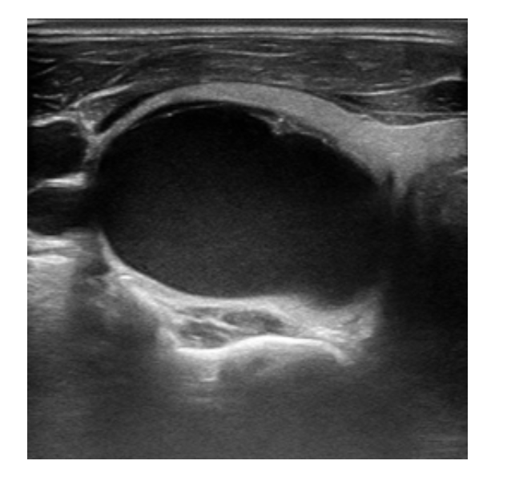
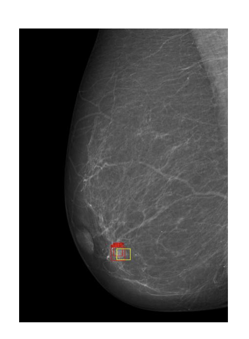
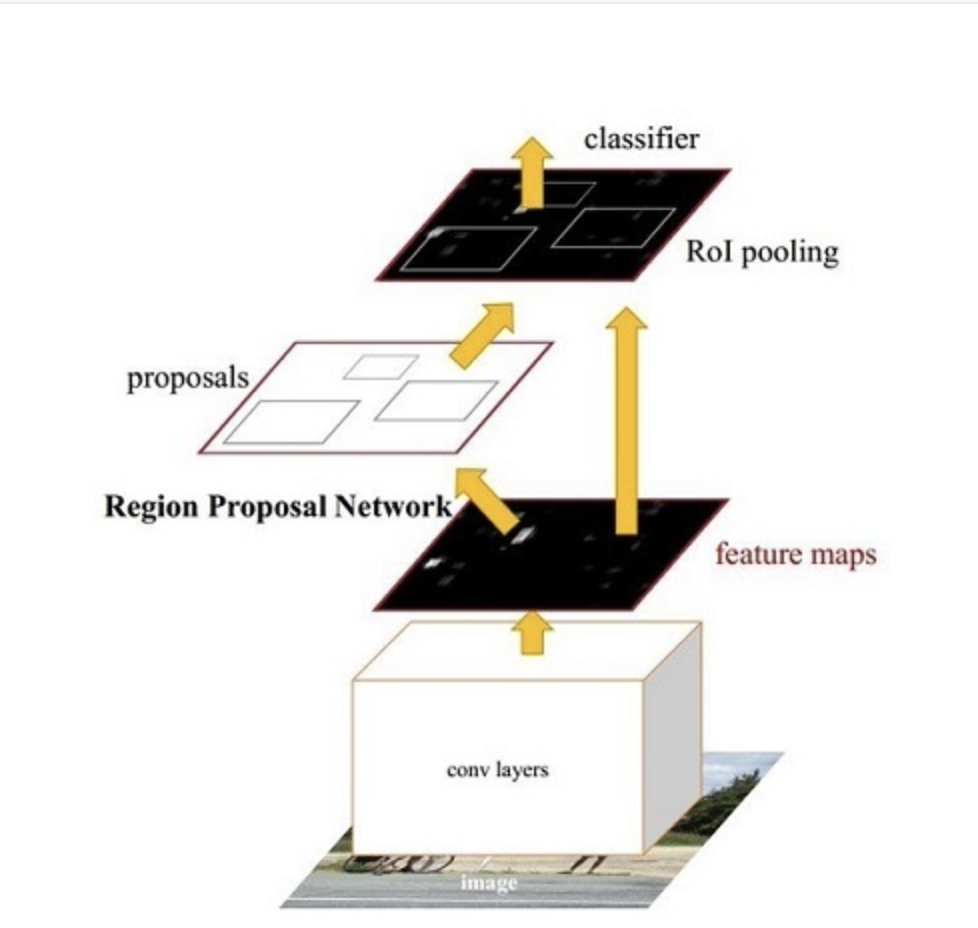
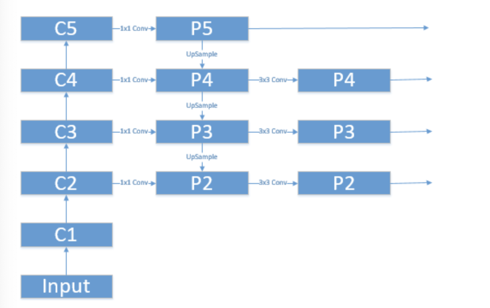

[TOC]

# 项目简介

```
Project introduction
```


本项目的构思是开发一个基于深度学习的乳腺肿瘤辅助诊断机器人。

```
The idea of this project is to develop a breast tumor assistant diagnosis robot based on deep learning.
```

给系统输入一张乳腺超声图像(病人拍的CT图像),模型就会利用训练好的模型迅速计算出肿瘤所在位置,并输出检测结果图像,并且能根据二维图像生成3D模型,医生能够通过点击3D模型的病变点来操纵机械臂进行手术.

```
if we input a breast ultrasound image (CT image taken by the patient) to the system, the model will quickly calculate the location of the tumor using the trained model, output the detection result image, and generate a 3D model according to the two-dimensional image. The doctor can operate the manipulator by clicking the lesion point of the 3D model
```

患者做完CT后,影像学资料自动生成虚拟的患者乳腺内部场景,并自动标记出肿瘤的位置,虚拟场景与患者真实体内场景一致,医生点击虚拟场景中病变位置,机器人手臂就能够导航到该位置.

```
After the patient completes CT, the imaging data will automatically generate a virtual internal scene of the patient's breast, and automatically mark the location of the tumor. The virtual scene is consistent with the real internal scene of the patient. The doctor clicks the lesion location in the virtual scene, and the robot arm can navigate to the location
```


# 项目技术点 

```
Project technical points
```


## 1. 深度学习识别肿瘤模型系统

```
Automatic breast tumor recognition system based on deep learning
```

### 1.1 乳腺检测手段技术

```
Breast detection techniques
```

超声,钼靶,核磁 (医院的CT技术)

```
Ultrasound, molybdenum target, nuclear magnetic resonance 
```

本项目采用超声图像作为数据集,下图为带有乳腺肿瘤的超声图像.

```
Ultrasonic image is used as data set in this project, and the following figure shows the ultrasound image with breast tumor
```

可以看到黑色的部分就是肿瘤

```
You can see that the black part is the tumor
```




### 1.2 医学图像处理技术

```
Medical image processing technology
```

分类：分疾病等级,例如肿瘤的一级,二级等

```
Classification: it is divided into disease grades, such as primary and secondary tumors
```

分割: 勾勒出肿块的边界，跟背景分割开来. 本图为超声图像经过分割后的图像,图中白色区域是肿瘤的轮廓.

```
Segmentation: outline the boundary of the mass and separate it from the background. This picture is the segmented image of the ultrasound image. The white area in the picture is the outline of the tumor
```


检测：标记出肿块所在的位置,本图为钼靶技术拍的照片

```
Segmentation: outline the boundary of the tumor and separate it from the background. The segmented image of the ultrasound image is as follows. The white area in the figure is the outline of the tumor
```




### 1.3 数据集的标注

分割：labelme。[https://github.com/wkentaro/labelme](https://github.com/wkentaro/labelme)。命令行直接输入labelme即可启动。标注文件是.json类型，内容是构成轮廓的若干point。
检测：labelImg。[https://github.com/tzutalin/labelImg](https://github.com/tzutalin/labelImg)。标注文件.xml类型，<name>和方框位置(左上角、右下角点坐标)

### 1.4 数据集的来源

数据来源于TNSCUI大赛，有带标签的乳腺超声图像约一千张

```
The data comes from tnscui competition. There are about 1000 labeled breast ultrasound images
```


### 1.5 检测模型技术

```
Technical points of automatic tumor detection system
```

检测模型选用Faster R-CNN，backbone采用resnet50，并利用FPN提升检测精确度。

```
Fast r-cnn is used as the detection model, resnet50 is used as the backbone, and FPN is used to improve the detection accuracy.
```




上图为Faster R-CNN模型结构，模型包括如下4个主要内容：

1. Conv layers。作为一种CNN网络目标检测方法，Faster RCNN首先使用一组基础的conv+relu+pooling层提取image的feature maps。该feature maps被共享用于后续RPN层和全连接层。
2. Region Proposal Networks。RPN网络用于生成region proposals。该层通过softmax判断anchors属于positive或者negative，再利用bounding box regression修正anchors获得精确的proposals。

1. Roi Pooling。该层收集输入的feature maps和proposals，综合这些信息后提取proposal feature maps，送入后续全连接层判定目标类别。
2. Classification。利用proposal feature maps计算proposal的类别，同时再次bounding box regression获得检测框最终的精确位置。



上图为特征金字塔即FPN结构。Faster R-CNN仅使用了单个高层特征进行后续的物体的分类和bounding box的回归，但是小物体本身具有的像素信息较少，在下采样的过程中极易被丢失，FPN网络结构能在增加极小的计算量的情况下，处理好物体检测中的多尺度变化问题。

